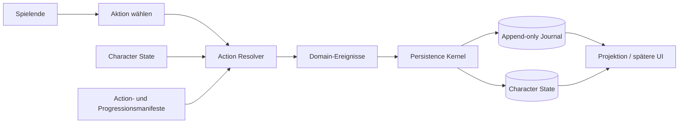
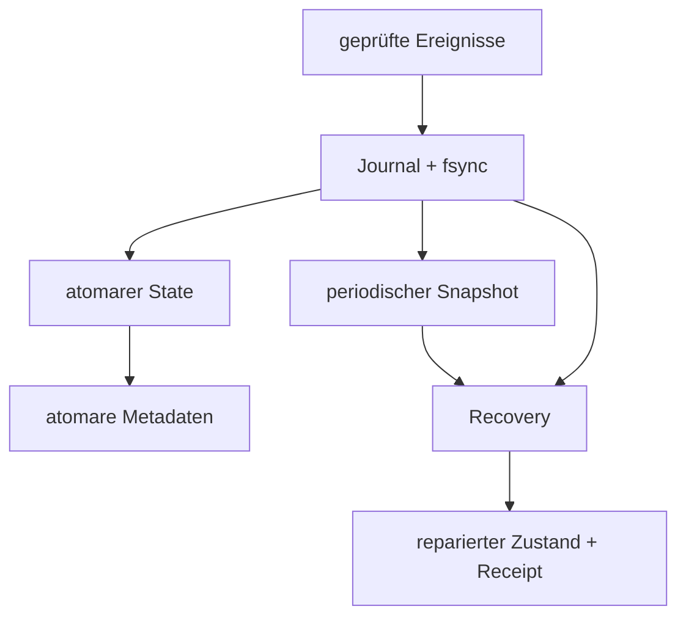

# Spielschema – BUNKERFREQUENZ

## Zweck

Dieses Dokument ist die fachliche Landkarte des Spiels. Es verbindet Spielidee, Kernobjekte und technischen Ereignisfluss in einfacher Sprache. Bei Details haben die verlinkten Fachverträge, Manifeste und JSON-Schemas Vorrang.

## Spielkern

Die Spielenden führen eine Crew durch Training, Praxis, Aufbau, Events und Krisen. Figuren beginnen spielmechanisch gleich. Erst wiederholtes Verhalten erzeugt Skill-Vorsprünge, Traits, Spezialisierungen und eine dynamische Biografie.



**Append-only** bedeutet: Bestehende Journal-Ereignisse werden nie überschrieben; Korrekturen entstehen durch neue kompensierende Ereignisse.

## Kernobjekte

| Objekt | Aufgabe | Stabile Identität |
|---|---|---|
| Character Definition | unveränderliche Herkunft und Inhaltsreferenzen | technische Character-ID |
| Character State | aktueller Name, Skills, Traits, Level und Resonanz | Character-ID + Zustandsversion |
| Action Definition | Voraussetzungen, Kosten, Risiko und Belohnungsgewichte | Action-ID |
| Domain-Ereignis | beschreibt eine eingetretene fachliche Änderung | Event-ID + Sequenz |
| Journal | chronologische, prüfbare Ereigniskette | Sequenz + Hashkette |
| Snapshot | schneller bestätigter Wiederanlaufpunkt | angewandte Sequenz |
| Textinhalt | sichtbarer lokalisierter Text | Textschlüssel, nie sichtbarer Name |

## Ablauf einer Aktion

1. Die Anwendung lädt Action Definition und Character State.
2. Der Resolver prüft Voraussetzungen und verwendet einen expliziten Seed.
3. Skills, Risiko und aktive Trait-Effekte bestimmen Ergebnis und Qualität.
4. Die Domain liefert Ereignisse; sie schreibt keinen dauerhaften Zustand direkt.
5. Der Persistence Kernel prüft Ereignistyp, Sequenz und Idempotenz (gleiches Ereignis wirkt nur einmal).
6. Das Journal wird dauerhaft geschrieben, bevor der abgeleitete Zustand aktualisiert wird.
7. Spätere UI-Ansichten lesen eine Projektion und lösen neue Anwendungsaktionen aus.

## Entwicklung einer Figur

```text
Praxis / Training / Krise / Team / Entdeckung / Erfolg / Fehlschlag
                              │
                 ┌────────────┴────────────┐
                 ▼                         ▼
              Skill-XP               Trait-Evidenz
                 │                         │
                 ▼                         ▼
           Skill-Level              fünf Trait-Stufen
                 └────────────┬────────────┘
                              ▼
                    Gesamtlevel bis 50
                              │
                              ▼
                  offene Resonanz-Ränge
```

- Training liefert weniger Trait-Evidenz als echte Praxis.
- Spezialisierung entsteht aus dauerhaftem Skill-Vorsprung, nicht aus einer Startklasse.
- Soft-Konflikte dämpfen nur positive Trait-Wirkungen; sie löschen keine Entwicklung.
- Positive und negative Runtime-Modifikatoren besitzen feste Grenzen.

Verbindliche Einzelheiten: [`CHARACTER_FORGE.md`](CHARACTER_FORGE.md) und [`PROGRESSION_CONTRACT.md`](PROGRESSION_CONTRACT.md).

## Speicherung und Wiederherstellung



`fsync` bestätigt das Schreiben gegenüber dem Betriebssystem. Atomar bedeutet: Eine Datei erscheint vollständig oder gar nicht. Beschädigte Journal-Enden werden vor einer Reparatur quarantänisiert und die Wiederherstellung wird in einem Receipt (Nachweis) dokumentiert.

Verbindliche Einzelheiten: [`PERSISTENCE_CONTRACT.md`](PERSISTENCE_CONTRACT.md) und [`RECOVERY_0.5.1.md`](RECOVERY_0.5.1.md).

## Schichtengrenzen

- **Domain:** berechnet Charakter- und Fortschrittsregeln ohne Dateisystem oder UI.
- **Application:** koordiniert Aktionen und Services.
- **Infrastructure:** speichert Journal, Zustand und Snapshots.
- **Presentation:** zeigt Projektionen und sendet Absichten; sie schreibt keinen Domain-Zustand.
- **Content:** liefert sichtbare Texte über Schlüssel und bleibt von Spiellogik getrennt.
- **Sync (später):** überträgt IDs, Versionen und Ereignisse; lokales Spielen bleibt möglich.

## Aktueller und geplanter Umfang

| Bereich | Stand |
|---|---|
| Character Core, Progression, Trait-Effekte | implementiert und lokal geprüft |
| Journal, State, Snapshot, Recovery, Profil-Undo | implementiert und lokal geprüft |
| A4 Ops Deck und A3 Cinematic Forge | für Phase 0.6 geplant |
| Wirtschaft und asynchrone Synchronisation | bewusst nachgelagert |

Der aktuelle Arbeitsauftrag steht ausschließlich in [`../TODO.md`](../TODO.md). Dieses Schema nimmt keine geplante Funktion vorweg.
